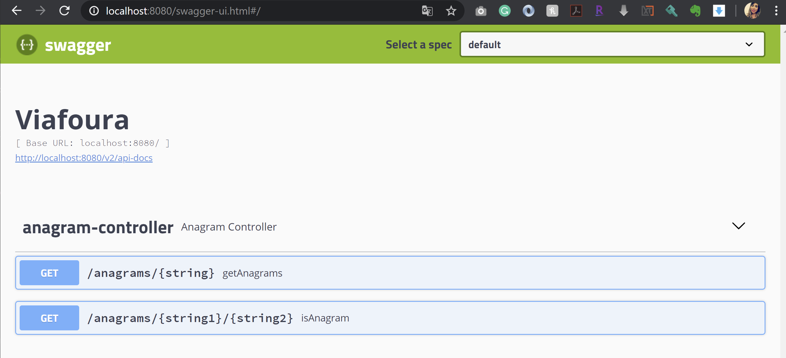

# Anagram - Viafoura

Rest API to work with anagrams.

**Anagram:** a word, phrase, or name formed by rearranging the letters of another, such as
cinema, formed from iceman.

## Functionalities
### Api anagrams:
- Endpoint GET `/anagrams/{string1}/{string2}`
    - Returns a 400 - Bad Request if either string1 or string2 are not valid
    - Returns a 200 - OK with the following JSON payload:
    `{ "areAnagrams: true|false }`
    where areAnagrams is true or false, depending on whether string1 and string2
    are anagrams of each other.
- Endpoint Get `/anagrams/{string}`
    - Returns a 400 - Bad Request if string1 is not valid
    - Returns a 200 - OK with the following JSON payload:
    `{ anagrams: [ ... ] }`

## Requirements
- Java 8
- Maven
- Spring Boot
- Swagger 

## Install dependencies

To build the server 

```sh
$ mvn clean install
```

```sh
$ docker build -t anagram .
```

## Running Application

To start the server 

```sh
$ docker run -p 8080:8080 anagram
```
## Using Api

You can test API in http://localhost:8080/swagger-ui.html

